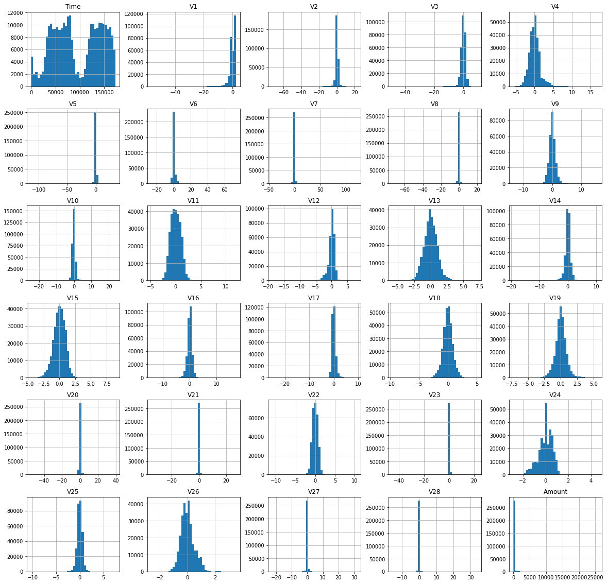

---
# EXPLORATORY DATA ANALYSIS #

## Observations ##

<ol>
<li>The shape of the dataset is (284807, 31).</li>
<li>The Dataset haven´t null or duplicated elements.</li>
<li>We dont have cathegorical data.</li>
<li>Each variable in the dataset is scaled.</li>
<li>The dataset is highly imbalanced (less than one percent of the data is from the class 1).</li>
<li>In the correlation matrix we can see some interesting variables that could be related with the interest class.</li>
<li>The box plots show some atypical data in the class 0, must be examined.</li>
</ol>
  
## Plots ##
  

