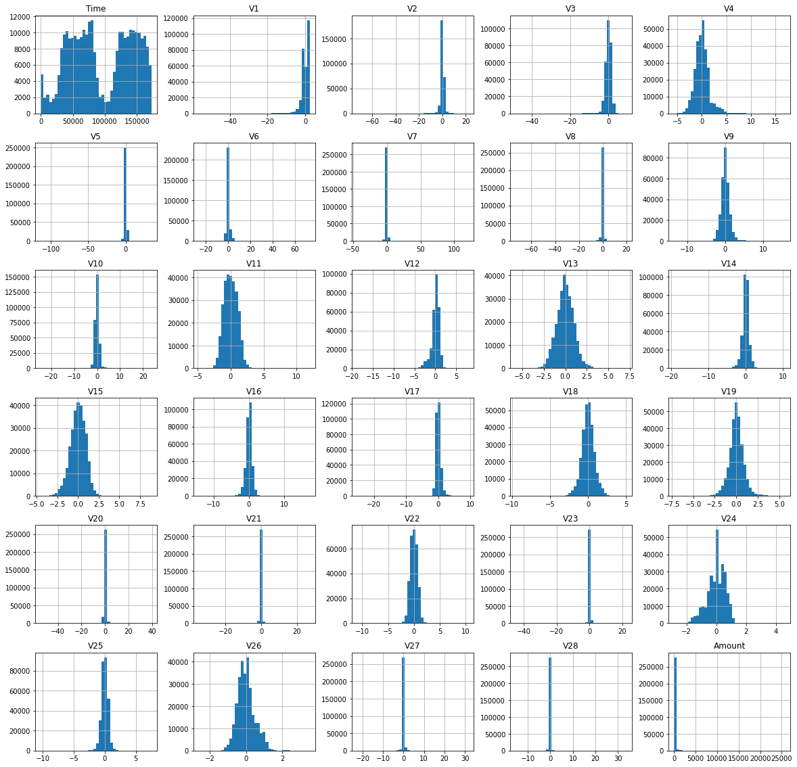
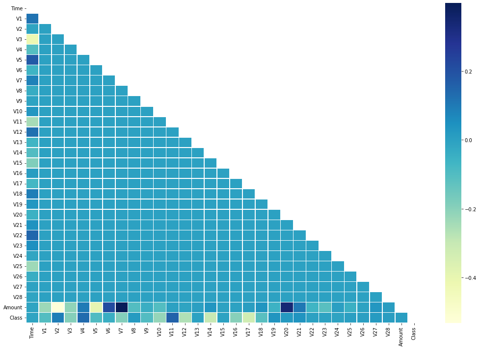
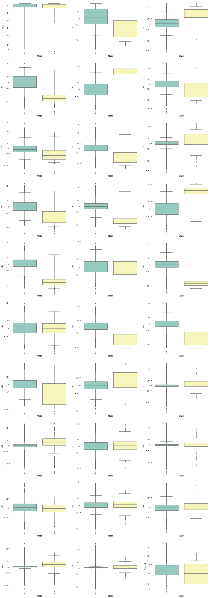
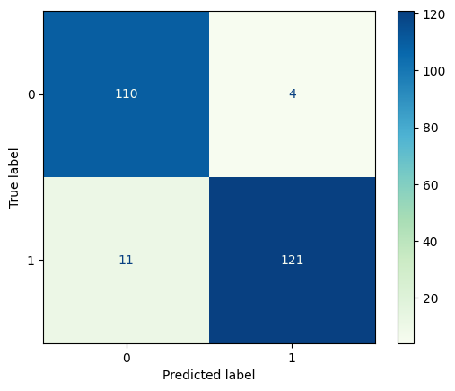
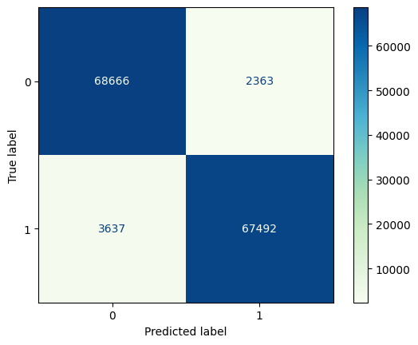

# Dealing With Imbalanced Data.
The imbalanced data refers a problemn where the number of observations is not equally distribuite.

## About the dataset.

.

## Repository Descripction
| Archivo | Descripcion |
| ------ | ----------- |
|[** __ **](https://github.com/NavarroRamon/)| __.|
|[** __ **](https://github.com/NavarroRamon/)| __.|

## Exploratory Data Analysis

<ol>
<li>The shape of the dataset is (284807, 31).</li>
<li>The Dataset haven´t null or duplicated elements.</li>
<li>We dont have cathegorical data.</li>
<li>Each variable in the dataset is scaled.</li>
<li>The dataset is highly imbalanced (less than one percent of the data is from the class 1).</li>
<li>In the correlation matrix we can see some interesting variables that could be related with the interest class.</li>
<li>The box plots show some atypical data in the class 0, must be examined.</li>
</ol>

*Click on the images to see in high resolution (or on the EDA folder for more information anf for the code used)*

## Logistic Regression ##

### Under sampling data ###

Using the **under sampling** data the **F1 score** for the model is: **94.16 %**

### Over sampling data ###

Using the **over sampling** data the **F1 score** for the model was equal to **95.74 %**
